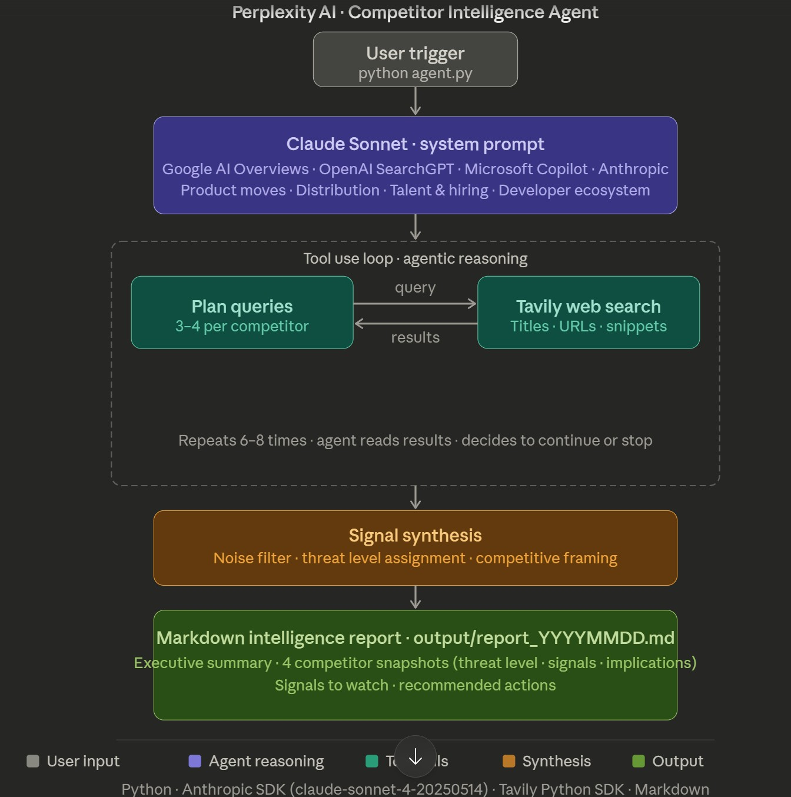

# Perplexity AI — Competitor Intelligence Agent

A production-ready competitive intelligence agent that monitors Perplexity AI's key competitors and generates structured weekly intelligence reports for the Head of Product.

Built with Claude Sonnet (Anthropic API) and Tavily Search API.

## Architecture



The agent follows a **tool-use loop pattern**:

1. **Trigger** — User runs `python agent.py` (or scheduled weekly via Windows Task Scheduler)
2. **System prompt** — Claude Sonnet receives the competitive monitoring scope: 4 competitors, 4 signal categories, signal vs. noise rules, and output schema
3. **Agentic search loop** — The agent autonomously plans and executes 6-8 targeted web searches via Tavily, reading results and deciding whether to search more or proceed to synthesis
4. **Synthesis** — Filters noise, extracts strategic signals, assigns threat levels, and frames findings for Perplexity's product leadership
5. **Output** — Structured Markdown report saved locally and appended to Notion as a collapsible Toggle Heading 2

## Competitors Monitored

| Competitor | Focus Area | Threat Vector |
|---|---|---|
| **Google** (AI Overviews) | Incumbent search + AI integration | Distribution, monetization, citation quality |
| **OpenAI** (SearchGPT / ChatGPT Search) | AI-native search | Enterprise adoption, agent capabilities, pricing |
| **Microsoft** (Copilot) | Enterprise productivity + search | Bundling, workflow integration, agent orchestration |
| **Anthropic** (Claude) | Foundation model provider | Context capabilities, pricing pressure, partnerships |

## Signal Categories

For each competitor, the agent tracks:

- **Product Moves** — New features, model upgrades, UI changes, search mode updates
- **Distribution & Partnerships** — Enterprise deals, browser integrations, device partnerships
- **Talent & Hiring** — Job postings signaling infrastructure investment or strategic pivots
- **Developer Ecosystem** — API launches, pricing changes, third-party integrations

## Setup

### Prerequisites

- Python 3.10+
- [Anthropic API key](https://console.anthropic.com/) — for Claude Sonnet
- [Tavily API key](https://tavily.com/) — free tier (1,000 searches/month)

### Installation

```bash
cd agents/perplexity-intel-agent
pip install -r requirements.txt
```

### Configuration

Create a `.env` file in the project root:

```
ANTHROPIC_API_KEY=sk-ant-your-key-here
TAVILY_API_KEY=tvly-your-key-here
```

## Usage

### Run manually

```bash
python agent.py
```

The agent will:
- Execute 6-8 targeted searches across all 4 competitors
- Synthesize findings into a structured report
- Save the report to `output/report_YYYYMMDD_HHMM.md`
- Print the full report to the console

### Scheduled (weekly)

The agent is configured to run every **Monday at 9:00 AM** via Windows Task Scheduler:

```
Task name: PerplexityIntelAgent
Script:    run-intel-agent.bat
Schedule:  Weekly, Monday, 09:00
Log:       C:\Users\gonza\perplexity-intel.log
```

## Output Format

Each report follows a consistent schema:

```
# Perplexity Competitor Intelligence Report
├── Executive Summary (2-3 sentences, top priority signal)
├── Competitor Snapshots (x4)
│   ├── Threat Level (High / Medium / Low)
│   ├── Key Signal (one sentence)
│   ├── Details (2-3 sentences with sources)
│   └── Strategic Implication for Perplexity
├── Signals to Watch (3 early/emerging signals)
└── Recommended Actions (2-3 specific, grounded recommendations)
```

Reports are delivered to a **Notion page** as Toggle Heading 2 blocks, organized chronologically:

```
▶ Competitor Intelligence Report — March 30, 2026
▶ Competitor Intelligence Report — April 7, 2026
▶ Competitor Intelligence Report — April 14, 2026
```

## Project Structure

```
perplexity-intel-agent/
├── agent.py              # Main agent loop — Claude API with tool use
├── tools.py              # Tavily search tool definition + executor
├── prompts.py            # System prompt (monitoring scope, signal rules, output schema)
├── run-intel-agent.bat   # Windows Task Scheduler entry point
├── requirements.txt      # Python dependencies
├── DELIVERABLE.md        # Full assignment submission (all 9 sections)
├── Visual.jpg            # Architecture diagram
├── .env                  # API keys (gitignored)
└── output/               # Generated reports (gitignored)
    └── report_YYYYMMDD_HHMM.md
```

## Tech Stack

| Component | Technology | Why |
|---|---|---|
| LLM | Claude Sonnet (Anthropic API) | Tool use API for autonomous search decisions, strong structured output |
| Search | Tavily Search API | Built for AI agents, structured results, recency filtering, free tier |
| Runtime | Python 3 | Lightweight orchestration (~80 lines), no framework overhead |
| Output | Notion + Markdown | Toggle Heading 2 for chronological reports, local Markdown backup |
| Scheduler | Windows Task Scheduler | Zero-infrastructure weekly automation |

## Limitations

- **Job posting intelligence is shallow** — Tavily returns aggregator pages rather than structured job board data, making the Talent & Hiring category the weakest signal source
- **No cross-week deduplication** — Each run is independent; persistent news gets re-reported as "new"
- **Single search tool** — No dedicated RSS, social media, or job board scrapers; trades coverage for simplicity
- **Free tier search limits** — 1,000 Tavily searches/month (~125 weekly runs), sufficient but not unlimited

## Cost

| Resource | Cost | Notes |
|---|---|---|
| Tavily Search | Free | 1,000 searches/month; agent uses ~8 per run |
| Claude Sonnet API | ~$0.10-0.15/run | ~4K input tokens (prompt + search results), ~2K output tokens |
| **Total per week** | **~$0.15** | |
| **Total per year** | **~$8** | |
