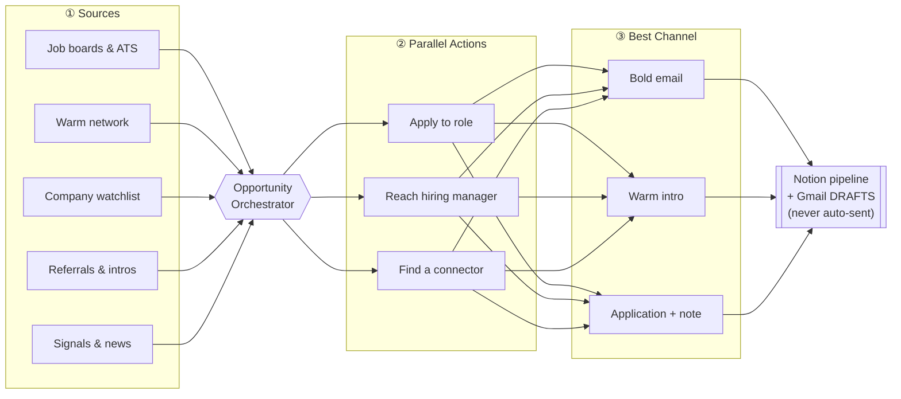
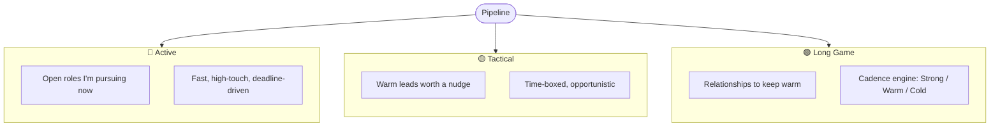
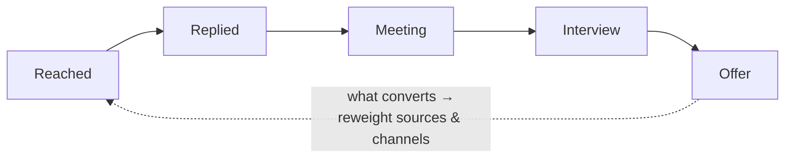

# Career

An AI-powered recruiting engine that runs a real job search end-to-end — from finding roles and people, to reaching the right person on the right channel, to tailoring materials, to measuring what actually converts.

It started as four standalone workflows. It's now a single operating model: **every opportunity is worked from multiple sources, through parallel actions, on the best available channel** — with humans approving before anything is sent.

## The operating model: Sources × Actions × Channels

Instead of "scrape jobs → apply," the engine treats each opportunity as something to attack from three angles at once — apply to the role, reach the hiring manager, and find a warm connector — then routes each move to whichever channel converts best.



**Key principle:** the engine automates research, scoring, and drafting — but every outbound message lands as a **Gmail draft for human review**. Nothing is ever auto-sent.

## Three motions

Every contact and role is sorted into one of three motions, each with its own cadence and intent.



The **Long Game** motion runs a cadence engine that surfaces who's going cold on a Strong / Warm / Cold rhythm and drafts context-aware follow-ups before the relationship lapses.

## Workflows

| Workflow | Trigger | What it produces |
|----------|---------|------------------|
| [**JobHunter**](./job-hunter/) | `"Find PM jobs at [company/segment]"` | Roles scraped across ATS platforms, scored for fit, deduped against the pipeline, grouped by vertical — surfaced for review before anything is committed |
| [**NetworkingScout**](./networking-scout/) | `"Find people at [company]"` | Ranked contacts (seniority + alumni affinity + relevance) with a tailored outreach angle for each |
| **Opportunity** (orchestrator) | `"Work [company / role]"` | Runs Apply + Reach-HM + Find-Connector in parallel and routes each to its best channel |
| **BoldEmail** (primary channel) | `"Draft a bold email to [person]"` | A proof-first, value-led cold email to a decision-maker — drafted, never auto-sent |
| [**ApplicationBlitz**](./application-blitz/) | `"Generate materials for [job]"` | A tailored-resume edit checklist + cover letter matched to the job |
| [**RelationshipNurture**](./relationship-nurture/) | `"Who do I need to follow up with?"` | Cadence-based nurture report + follow-up drafts for the Long Game motion |
| **FunnelReport** (measurement) | `"How's the funnel doing?"` | Conversion at every stage — reached → replied → meeting → interview → offer |

Discovery and prep sit on either side of this engine: **Storyteller** and an interview coach turn a target role into a prep sheet and live mock, while a **Chief-of-Staff track** runs the same machinery tuned for CEO-facing roles.

## Measurement loop

The engine doesn't just act — it scores itself. Every send is logged, every stage is measured, and the numbers feed back into where effort goes next.



Two findings drive the whole strategy:

- **Warm beats cold ~10×.** Referrals and intros convert far above cold applications, so the engine prioritizes finding a connector over blasting applications.
- **Fresh beats stale.** Applying early to a newly-posted role dramatically outperforms applying late — so speed and signal-watching are first-class.

A **role-type multiplier** further weights each opportunity by archetype (e.g. growth, founding/forward-deployed, and AI-builder roles score higher for fit) so effort concentrates where the odds are best.

## Example

**Input:**
```
"Work Notion — Senior PM, Platform"
```

**The engine:**
1. **Sources** — confirms the live role, pulls recent company signals, checks the warm network for anyone inside
2. **Actions (parallel)** —
   - *Apply:* generates a tailored resume checklist + cover letter for the role
   - *Reach HM:* identifies the hiring manager and drafts a proof-first bold email
   - *Find connector:* surfaces two Berkeley-affiliated contacts and drafts intro-request notes
3. **Channel** — routes the HM message to email, the connector asks to warm intro, the application through the ATS with a personalized note
4. **Output** — everything lands in the Notion pipeline and as Gmail **drafts**, tagged to the right motion, ready for a final human read before send

## Stack

Python · Claude API · Notion API · Gmail (draft-only) · reportlab (PDF) · scheduled automations

---

> This is a curated showcase of the workflows — not the underlying implementation. Prompts and structure are shared; credentials, database IDs, and skill internals are not.
