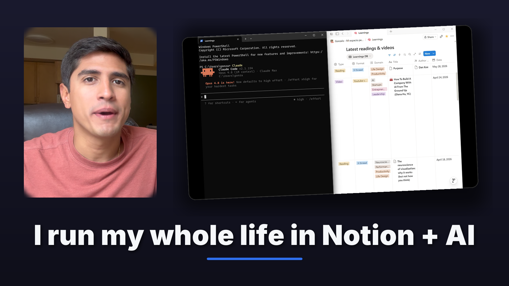

# VideoThumbnailGenerator

**Type:** On-Demand Python Script (Pillow)
**Skill Domain:** ContentVoice
**Trigger:** `"Generate a thumbnail for my video"`

## What It Does

Turns a raw LinkedIn video into a publish-ready 1920×1080 thumbnail — programmatically, with no design tools. It composites three elements into a consistent, branded layout: a face frame from the talking-head footage, a screenshot of the key screen moment, and a one-line hook. Every output looks like *my* videos, so the feed builds brand recognition after a few posts.

LinkedIn doesn't let you change a thumbnail after publishing, so it has to be right the first time. This makes that a 30-second step instead of a Canva detour.



*Generated from my "Claude + Notion" video — face pulled from the talking-head intro, screen from the Claude Code + Notion database moment, hook auto-fit to one line.*

## How It Works

One command, three inputs (face, screen, hook). It can pull frames straight from the video with ffmpeg, so I only hand it timestamps:

```bash
python thumbnail.py \
  --face-video   recording.mp4 --face-ss   00:00:06 \
  --screen-video recording.mp4 --screen-ss 00:00:40 \
  --hook  "I run my whole life in Notion + AI" \
  --topic claude-notion
```

**Pipeline:**
1. Frame extraction (ffmpeg) — I pick the timestamp of my best on-camera moment; it grabs that frame plus the key screen frame.
2. Face card — cover-cropped, rounded, soft-feathered edge that blends into the background. Off-center subjects are handled with a focus control, and the crop sits above any baked-in subtitle band.
3. Screen card — fit, rounded, given a thin light border and a blurred drop shadow, then tilted ~2.5° for depth.
4. Hook — Inter Black, auto-sized to fit one line, white with a soft shadow and a brand-blue (`#2F6FED`) accent underline, on a dark navy gradient.
5. Export — exactly 1920×1080 sRGB, kept under 2 MB (auto-falls back to progressive JPG if a PNG exceeds it), plus a 400 px preview that simulates the LinkedIn mobile feed.

## Design Decisions

- **Why code instead of Canva?** Consistency and speed. A template I run from the command line produces the same recognizable layout every time, in seconds, at publish — no drifting fonts, colors, or spacing across posts.
- **Why a face *and* a screen?** These videos are person + screen recording. The face earns the human connection; the screen signals "this is a real system, not talk." Together they *are* the branding — no logos, icons, or emojis needed.
- **Why "legible, not readable"?** The screenshot only has to make a senior PM or founder think *"that's a real tool"* — it doesn't need to be read at thumbnail size. That keeps the composition clean.
- **Why no clickbait?** This is a professional feed. No red arrows, no shocked faces, no YouTube aesthetic. The bar is "stop the scroll and tap," not "trick the click."
- **Why hand it timestamps?** I know which frame is my best face; the tool shouldn't guess. I pick the moment, it does the production work.

## Output Structure

```
output/
├── YYYYMMDD_<topic>_thumbnail.png          # 1920x1080, <2MB, sRGB
└── YYYYMMDD_<topic>_thumbnail_preview.png  # 400px mobile-feed sanity check
```

## A/B Levers

Built-in flags to test what lifts play rate (only change the template after 5+ data points):
`--bg navy|black|brand` · `--text-pos top|bottom` · `--face-pct` (face size) · `--tilt` · `--pill` (dark pill behind hook) · `--face-focus-x/y` (off-center subjects).

## Stack

Python · Pillow (PIL) · ffmpeg · Inter variable font
